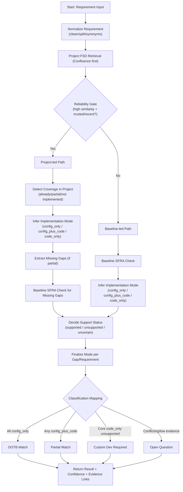

# SFRA Requirement Classification: Final Flow

This document defines the final decision flow and response shape to guide implementation.

## Flow Diagram



## Classification Mapping

- `config_only` -> `OOTB Match`
- `config_plus_code` -> `Partial Match`
- `code_only` with unsupported gap -> `Custom Dev Required`
- low/conflicting evidence -> `Open Question`

## Sample Responses

### 1) OOTB Match (Success Case)

```json
{
  "requirement": "Add a product carousel on homepage via Business Manager",
  "classification": "OOTB Match",
  "confidence": 0.89,
  "implementation_mode": "config_only",
  "coverage_status": "supported",
  "project_match_status": "already_implemented",
  "gaps": [],
  "rationale": "Project FSD and SFRA/Page Designer evidence indicate this can be configured through BM without net-new code.",
  "evidence": {
    "sfra_baseline": [
      {
        "title": "Page Designer Components",
        "url": "https://developer.salesforce.com/docs/commerce/sfra/..."
      }
    ],
    "project_fsd": [
      {
        "title": "Homepage Components - FSD",
        "url": "https://confluence.../..."
      }
    ]
  },
  "next_steps": [
    "Merchant Tools > Content > Page Designer",
    "Add/configure product carousel component",
    "Assign products/rules and publish"
  ]
}
```

### 2) Partial Match

```json
{
  "requirement": "Add homepage product carousel with dynamic new-arrivals logic and custom card badge",
  "classification": "Partial Match",
  "confidence": 0.81,
  "implementation_mode": "config_plus_code",
  "coverage_status": "supported_with_extensions",
  "project_match_status": "partially_implemented",
  "gaps": [
    "Dynamic new-arrivals ranking rule not available in current BM config",
    "Custom product badge rendering requires template/component update"
  ],
  "rationale": "Base carousel is supported via BM/Page Designer, but requested ranking and badge behavior need cartridge/template changes.",
  "evidence": {
    "sfra_baseline": [
      {
        "title": "Page Designer Product Components",
        "url": "https://developer.salesforce.com/docs/commerce/sfra/..."
      }
    ],
    "project_fsd": [
      {
        "title": "Homepage Carousel Setup - FSD",
        "url": "https://confluence.../..."
      }
    ]
  },
  "delivery_split": {
    "config_only": [
      "Create carousel component in Page Designer",
      "Set product source and publish schedule"
    ],
    "code_changes": [
      "Add custom sorting hook for new arrivals",
      "Update ISML/component to render custom badge"
    ]
  }
}
```

### 3) Custom Dev Required

```json
{
  "requirement": "Enable AI-generated personalized product bundles in BM with one-click add-all",
  "classification": "Custom Dev Required",
  "confidence": 0.84,
  "implementation_mode": "code_only",
  "coverage_status": "unsupported",
  "project_match_status": "not_implemented",
  "gaps": [
    "No native SFRA/BM feature for AI bundle generation",
    "No existing project implementation found in FSDs"
  ],
  "rationale": "Requirement needs net-new recommendation logic, API orchestration, and storefront + BM custom UI/code.",
  "evidence": {
    "sfra_baseline": [],
    "project_fsd": []
  }
}
```

### 4) Open Question

```json
{
  "requirement": "Add smart carousel with dynamic ranking",
  "classification": "Open Question",
  "confidence": 0.42,
  "implementation_mode": "uncertain",
  "coverage_status": "uncertain",
  "project_match_status": "uncertain",
  "gaps": [
    "Ranking criteria and data source not specified",
    "Unclear if BM rules are sufficient or custom service is required"
  ],
  "rationale": "Evidence is insufficient to reliably determine OOTB vs extension.",
  "clarifying_questions": [
    "Should ranking be based on BM rules only, or external analytics signals?",
    "Do you need per-user personalization or a global ranking?"
  ]
}
```

## Notes for Implementation

- Keep this pipeline evidence-first. Do not assign `Custom Dev Required` without explicit evidence of unsupported behavior.
- Treat project FSD as first-pass evidence, but keep the reliability gate before trusting it.
- Always infer and return `implementation_mode` for both project-led and baseline-led paths.
